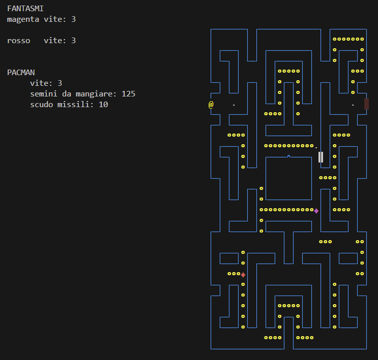

# PACMAN GAME
This project is a simple implementation of the classic Pacman game. The game is implemented in C language and uses the ncurses library to display the game on the terminal. The game consists of a maze where Pacman must eat all the dots while avoiding the ghosts. The ghosts move randomly and can kill Pacman if they touch him. Both pacman and ghosts can fire missiles to kill each other. Pacman has an anti-missile shield that can be used to protect him from a few missiles. Ghots have lives too: when a ghost is killed, it will move to the jail and will be released after a few seconds. The game ends when Pacman loses all his lives or when he eats all the dots.

## INSTRUCTIONS TO COMPILE AND RUN THE PROJECT
 1)   Open a terminal Ubuntu-like
 2)   Navigate to the project folder
 3)   If you modify the code, run the command "make"
 4)   Start the executable "./pac_man"

## PACMAN KEYS
* `<space>`: Fires missiles in every possible direction. 
  Until the missile fired in a given direction "explodes", it will not be possible to re-fire in that direction.
* `<left arrow>`: Moves Pacman, if possible (if there is no wall), 1 square to the left.
* `<up arrow>`: Moves Pacman, if possible (if there is no wall), 1 square up.
* `<right arrow>`: Moves Pacman, if possible (if there is no wall), 1 square to the right.
* `<down arrow>`: Moves Pacman, if possible (if there is no wall), 1 square down.

## OBJECT INFORMATION
* Pacman Lives: 3
* Anti-Missile Shield: 10

* Number of Ghosts: 4
* Ghost Lives: 3
* Missile Firing Interval: 1-3 seconds
* Jail Interval: 5-10 seconds

# EXAMPLE

